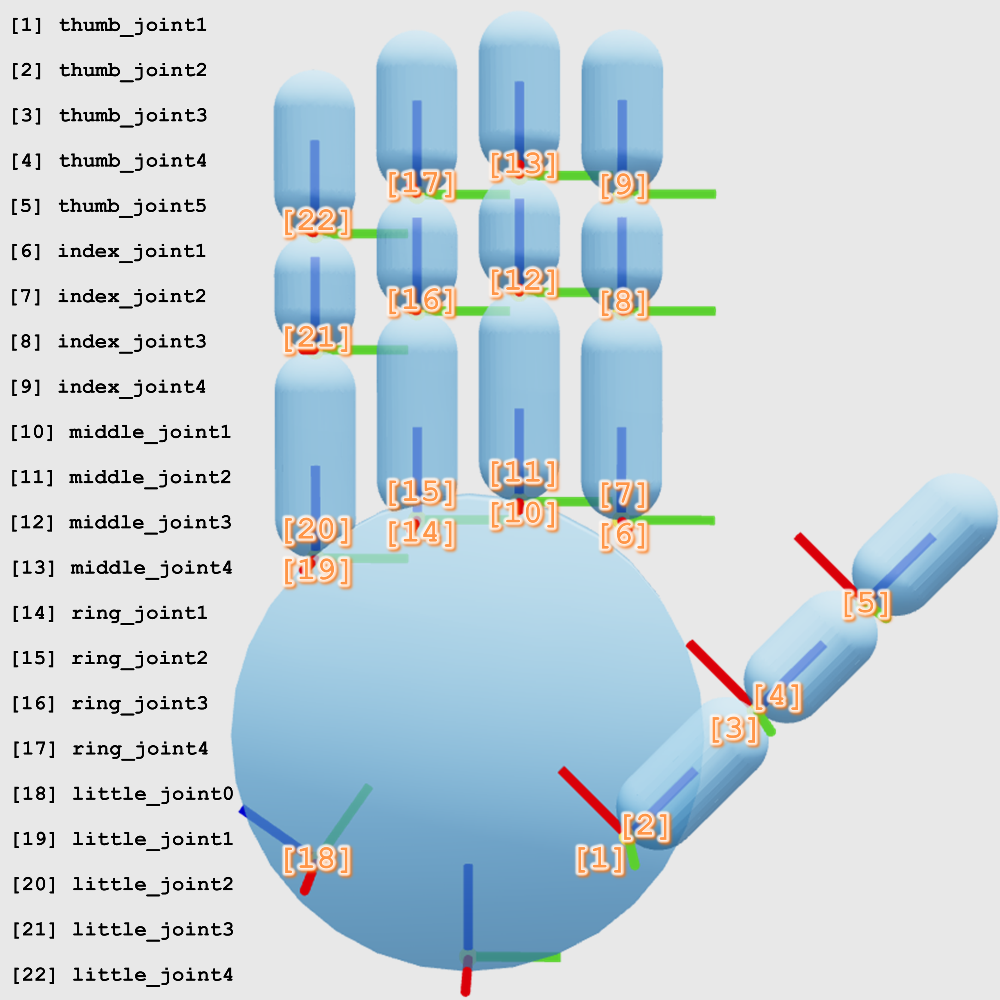

# [RSS 2026] One Hand to Rule Them All 

Official Code Repository for **One Hand to Rule Them All: Canonical Representations for Unified Dexterous Manipulation**.

[Zhenyu Wei](https://zhenyuwei2003.github.io/), Yunchao Yao, [Mingyu Ding](https://dingmyu.github.io/)

University of North Carolina at Chapel Hill


<p align="center">
    <a href='#'>
      
    </a>
    <a href='https://zhenyuwei2003.github.io/OHRA/'>
      
    </a>
</p>


We introduce a canonical hand representation that unifies diverse dexterous hands into a shared parameter space and canonical URDF format, serving as a condition for cross-embodiment policy learning. It enables dexterous grasping and zero-shot generalization to novel hand morphologies, highlighting its potential for a wide range of dexterous manipulation tasks.

----------------

## Prerequisites:
`Python <= 3.8` if you want to use Isaac Gym for simulation.

## Get Started:
```bash
conda create -n ohra python=3.8 -y
conda activate ohra
pip install diffusers fpsample hydra-core jinja2 nflows omegaconf pytorch_kinematics pytorch_lightning scipy termcolor torch trimesh viser wandb
```

### Install Isaac Gym Environment
Download [Isaac Gym](https://developer.nvidia.com/isaac-gym/download) from the official website, then:

```bash
tar -xvf IsaacGym_Preview_4_Package.tar.gz
cd isaacgym/python
pip install -e .
```

### Dataset:
Download the [dataset](https://drive.google.com/file/d/1MI2mJLwGbg9ESIZwDBJvbGO3XlRuYOkb/view?usp=sharing) and extract it to the `data/` directory.

## Create a New Canonical Hand:
1. Add the hand URDF file to `assets/robot_urdf/`.
2. Create the hand meta information JSON file to `assets/meta_infos/`.
3. Run `utils/urdf_parser.py` to extract the initial canonical hand parameters. Although the parser handles many common URDF conventions, due to the various URDF format and design, some manual adjustments may be needed for certain hands.
4. Run `utils/urdf_render.py` to generate the canonical URDF file.
5. Run `visualization/vis_compare.py` to visualize the difference between the original hand model and the generated canonical hand model. If there exists discrepancies, go back to Step 3, manually adjust the parameters, and repeat the process until the canonical model provides a satisfactory approximation.

## Canonical Hand Designs:


The canonical hand template is designed based on the following rules:

1. A dexterous hand is represented as a palm with up to five fingers: `thumb`, `index`, `middle`, `ring`, and `little`. Each finger can have up to 3 links, named as `proximal`, `middle`, and `distal` from the base to the fingertip.

2. The canonical hand contains 22 joints in total: 5 joints for the thumb, 4 joints for the index finger, 4 joints for the middle finger, 4 joints for the ring finger, and 5 joints for the little finger. The joint order is shown in the right figure. 

3. Not all 22 joints need to be active. If a certain finger or joint does not exist in the original hand, the corresponding canonical joint is kept inactive by setting both its lower and upper limits to `0.0`. The URDF template dynamically adjusts finger links and joint connections according to the active joints, allowing the canonical hand to represent hand morphologies with different numbers of fingers and DoFs.

4. The canonical URDF uses simplified primitive geometry. The palm is represented by a cylinder, and each finger link is represented by a capsule. The dimensions of these primitives are determined by the hand parameters.

5. The hand frame follows the convention:
   - `+x`: palm upright direction
   - `+y`: thumb-side direction for a right hand
   - `+z`: finger-forward direction

### Base Version:
The base canonical parameterization is a compact 82-dimensional representation. It is designed to capture the most important morphology and kinematic properties while removing unnecessary URDF-specific details.

**Parameters Details:**
- `palm_radius (1,)`: radius of the palm cylinder.
- `finger_radius (1,)`: shared radius of all finger capsules.
- `finger_lengths (2, 3)`: link lengths of the fingers. The first row corresponds to the thumb links: `(proximal, middle, distal)`. The second row is shared by the four non-thumb fingers: `(proximal, middle, distal)`. If a certain link does not exist in the original hand, the corresponding length is set to `0.0`.
- `finger_xyz (5, 3)`: base position `(x, y, z)` of each finger in the hand frame. The finger order is `thumb`, `index`, `middle`, `ring`, and `little`. If a certain finger does not exist in the original hand, the corresponding position is set to `(0.0, 0.0, 0.0)`.
- `little_extra_origin (6,)`: origin `(xyz + rpy)` of `little_joint0`, which is used to represent the special base-side kinematic structure of the little finger in some hand models, such as Shadow Hand and Sharpa Wave. If the little finger does not have this special structure, all values are set to `0.0`.
- `thumb_rpy (3,)`: base rotation `(roll, pitch, yaw)` of the thumb relative to the hand frame.
- `thumb_axes (2, 3)`: rotation axes of `thumb_joint1` and `thumb_joint2`. If a certain thumb joint does not exist in the original hand, the corresponding axis is set to `(0.0, 0.0, 0.0)`.
- `joint_lowers [5, 4, 4, 4, 5]`: lower limits of all canonical joints. The order follows the joint order shown in the figure.
- `joint_uppers [5, 4, 4, 4, 5]`: upper limits of all canonical joints. The order follows the joint order shown in the figure.

**Assumptions:**
- The palm depth is the same as the finger diameter.
- All fingers share the same radius.
- All non-thumb fingers use identical link lengths.
- All non-thumb fingers lie on the palm-aligned $yz$-plane.
- `{thumb, index, middle, ring, little}_joint1` and `{thumb, index, middle, ring, little}_joint2` share the same origin.
- `thumb_joint3` and `thumb_joint4` share the same origin.
- The rotation axis of `thumb_joint3` and `{index, middle, ring, little}_joint1` is `+x`.
- The rotation axis of `thumb_joint{4, 5}`, `{index, middle, ring, little}_joint{2, 3, 4}` and `little_joint0` is `+y`.

### Extended Version:
The extended canonical parameterization is a more expressive 173-dimensional representation. It is designed to relax many assumptions in the base version and more faithfully encode hand designs with non-standard kinematic layouts.

**Parameters Details:**
- `palm_radius (1,)`: radius of the palm cylinder.
- `finger_radii (5,)`: radius of each finger capsule. The finger order is `thumb`, `index`, `middle`, `ring`, and `little`. If a certain finger does not exist in the original hand, the corresponding radius is set to `0.0`.
- `finger_lengths (5, 3)`: link lengths of the five fingers. If a certain link does not exist in the original hand, the corresponding length is set to `0.0`.
- `joint_origins ([3, 2, 2, 2, 3], 6)`: origins `(xyz + rpy)` of the explicitly parameterized joints. These include the first three joints of the thumb and little finger, and the first two joints of the index, middle, and ring fingers. This allows the representation to model diverse finger positions, local orientations, and special kinematic structures.
- `joint_axes ([3, 2, 2, 2, 3], 3)`: rotation axes of the same 12 explicitly parameterized joints. 
- `joint_lowers [5, 4, 4, 4, 5]`: lower limits of all canonical joints. The order follows the joint order shown in the figure.
- `joint_uppers [5, 4, 4, 4, 5]`: upper limits of all canonical joints. The order follows the joint order shown in the figure.

### Meta Info Details:
- `urdf_path`: paths to the original and canonical hand URDF files.
- `dof`: degrees of freedom of the original hand.
- `palm_origin`: origin `(xyz + rpy)` of the potential canonical base frame expressed in the original hand frame. This is used to align the canonical hand with the original hand.
- `joint_mapping`: mapping from original joint names to the canonical joint order.
- `canonical_order`: original joint indices, using 1-based indexing, arranged in canonical joint order. A value of `0` indicates that the corresponding canonical joint is inactive. Negative values indicate that the canonical joint rotation axis is reversed relative to the original joint axis. This is used to convert the original joint values to the canonical joint values.

## Training and Validation:
You may need to modify the configuration files in `config/`. After that, you can simply run the training and validation scripts in `scripts/`. For validation, you can use scripts end with `mp` to utilize multi-GPU acceleration.

## Repository Structure

```bash
src/
├── assets/
│   ├── canonical/
│   │   ├── json/  # Canonical hand parameters
│   │   ├── json/  # Canonical hand URDFs
│   │   └── dex_template.jinja2  # Jinja2 template for canonical hand URDF
│   ├── canonical_extended/
│   │   ├── json/  # Extended canonical hand parameters
│   │   ├── json/  # Extended canonical hand URDFs
│   │   └── dex_template.jinja2  # Jinja2 template for extended canonical hand URDF
│   ├── meta_infos/  # Hand meta information for usage
│   └── robot_urdf/  # Original URDFs of various robot hands
├── configs/
├── data/  # Datasets
├── data_utils/  # Dataloaders and data processing scripts
├── grasp_zeroshot/  # Specific codes for zero-shot grasping experiments
├── IsaacGym/
├── model/
├── scripts/
├── third_party/  
│   └── lightning-grasp/  # Used to generate the grasping dataset for LEAP Hand variants
├── utils/
│   ├── hand_model.py  # Hand model for various functions
│   ├── rotation.py  # Rotation conversions
│   ├── urdf_parser.py  # Used to parse the original hand URDF
│   └── urdf_render.py  # Convert the canonical hand parameters to a URDF file
└── visualization/ # Visualization scripts
```

## Citation
If you find our codes or models useful in your work, please cite [our paper](https://arxiv.org/abs/2602.16712):

```
@article{wei2026one,
    title={One Hand to Rule Them All: Canonical Representations for Unified Dexterous Manipulation},
    author={Wei, Zhenyu and Yao, Yunchao and Ding, Mingyu},
    journal={arXiv preprint arXiv:2602.16712},
    year={2026}
}
```

## Contact

If you have any questions, feel free to contact me through email ([wzhenyu@cs.unc.edu](mailto:wzhenyu@cs.unc.edu))!
